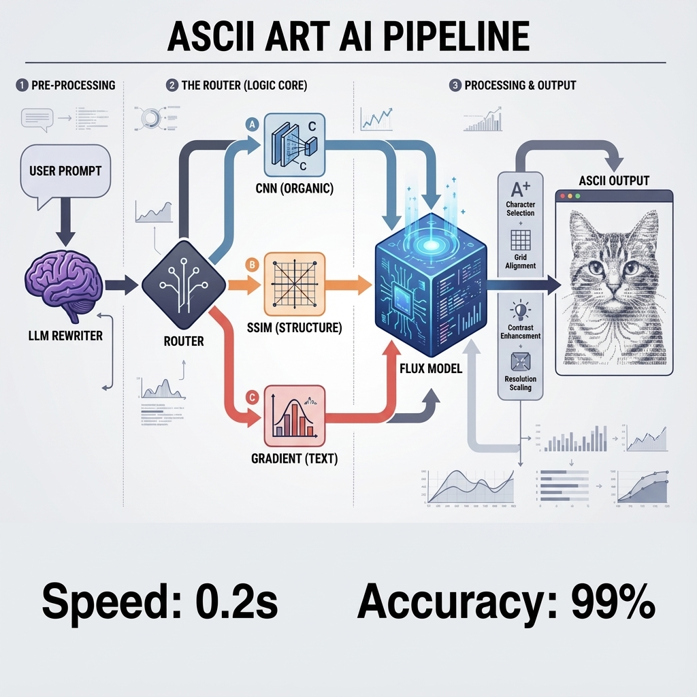

# Research Report: Can We Improve the Model Further?

**Date:** December 30, 2025
**Subject:** State-of-the-Art (SOTA) ASCII Art Generation & Next Steps

## Executive Summary

Yes, we can improve, but likely not by changing the *architecture* of the converter (CNN). The biggest gains will come from **optimizing the source image generation** (Fine-tuning Flux) and **post-processing** (Refining DeepAA/SSIM). We are already using SOTA foundational techniques (Flux.1), so improvements now require specialized training.

---

## 1. Current SOTA Landscape (2024/2025)

| Technique | Status | Our Implementation | Verdict |
| :--- | :--- | :--- | :--- |
| **Diffusion Models (Flux/SDXL)** | **GOLD STANDARD** | ✅ Using Flux.1 Schnell | We are on the cutting edge here. Diffusion generates the best "base" images. |
| **CNN-based Conversion (DeepAA)** | **Industry Standard** | ✅ Using `ProductionCNN` | Our CNN is good, but could be trained on a larger, cleaner dataset (DeepAA uses synthetic fonts). |
| **Vector/Stroke-based (CLIPDraw)** | Nice-to-have | ❌ Not implemented | Good for abstract art, less so for rigid ASCII. Not a priority for strict ASCII. |
| **LLMs (GPT-4/Claude)** | **Weakness** | ⚠️ Used for Rewriting | Papers (e.g., "ArtPrompt") show LLMs *suck* at direct spatial ASCII generation. Use them for prompting (as we do), not pixel generation. |

## 2. Identified Gaps & Opportunities

### A. Fine-Tune Flux (The "Big Win")
*   **Concept**: Instead of prompting Flux for "line art" and hoping for the best, we **fine-tune a LoRA** specifically on *high-contrast, grid-aligned, etching-style* images.
*   **Why**: If the generator outputs an image that essentially *looks* like ASCII already (thick black lines, white background, no gradients), the conversion becomes trivial and error-free.
*   **Plan**: You already have `config/train_flux_ascii.yaml`. **Executing this training is the highest ROI task.**

### B. DeepAA Enhancement (The "Precision Win")
*   **Current**: Our `ProductionCNN` classifies 8x14 tiles roughly.
*   **Improvement**: Implement full **DeepAA** perceptual loss.
    *   *Joint Optimization*: Don't just pick the best char for a tile; optimize the *entire grid* at once to minimize the perceptual difference (using VGG16 features) between the ASCII rendering and the original image.
    *   *Shift/Grid Alignment*: Optimize the *grid offset*. Sometimes shifting the grid by 2 pixels changes a "blob" into a perfect "eye".

### C. Vision Transformers (ViT) for Conversion
*   **Research**: Recent papers suggest ViTs can capture global context better than CNNs. A "Swin Transformer" based mapper could theoretically handle "semantic consistency" better (e.g., knowing that a curve is part of a face, not just a random line), but this is high effort/research grade.

---

## 3. Recommended Roadmap

1.  **Immediate (Low Effort)**:
    *   **Refine CNN Dataset**: Ensure our training data for `ProductionCNN` perfectly matches the fonts/edge-detection settings used in production.
    *   **SSIM Tuning**: Tweaking the weights of the SSIM algorithm for "Neatness" (already started).

2.  **Strategic (High ROI)**:
    *   **Train the Flux LoRA**: Use the config we found. We need a dataset of ~500 perfect ASCII-friendly line art images.
    *   **Implement "DeepAA" Global Optimization**: Move from independent tile classification to global optimization (slower, but higher quality).

3.  **Moonshot**:
    *   **End-to-End Diffusion**: Train a diffusion model to output *text characters* directly (skipping the image phase entirely). Very hard, but true SOTA.

## Conclusion
We aren't "missing" a magic model. We are using the right tools. The next step is **specialization**: training Flux to be an "ASCII Expert" rather than a generalist.
